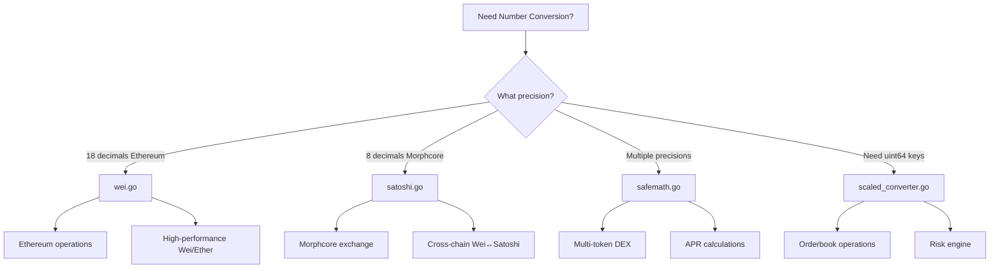

# SafeMath Package Documentation

## Overview

The `safem` package provides safe arithmetic operations for blockchain and financial calculations in the Morphcore system. It includes specialized modules for different use cases, from high-performance orderbook operations to multi-token conversions.

## Package Structure

```
safem/
├── wei.go              # Ethereum Wei (1e18) conversions
├── satoshi.go          # Morphcore Satoshi (1e8) conversions
├── scaled_converter.go # High-performance uint64 key conversions
├── safemath.go         # General-purpose multi-base conversions
└── docs/
    ├── README.md           # This file
    ├── wei.md              # Wei conversion documentation
    ├── satoshi.md          # Satoshi conversion documentation
    ├── scaled_converter.md # Scaled converter documentation
    └── safemath.md         # SafeMath documentation
```

## Quick Decision Guide

### Which Module Should I Use?



### Decision Matrix

| Use Case | Recommended Module | Why |
|----------|-------------------|-----|
| Ethereum Wei/Ether only | `wei.go` | Optimized performance |
| Morphcore Satoshi (8 decimals) | `satoshi.go` | Memory-efficient, cross-chain |
| Multiple token types | `safemath.go` | Flexible decimal precision |
| Orderbook price keys | `scaled_converter.go` | Fast uint64 sorting |
| Risk engine calculations | `scaled_converter.go` | Fast comparisons |
| APR/interest calculations | `safemath.go` | Time-based functions |
| EIP-712 payload processing | `satoshi.go` | String-based conversions |
| High-frequency trading | `wei.go` or `scaled_converter.go` | Performance-optimized |

## Module Comparison

### Performance Characteristics

| Module | Performance | Memory | Use Case |
|--------|------------|--------|----------|
| `wei.go` | Excellent (fast path: 6.5ns) | Low (0-168 B/op) | Ethereum operations |
| `satoshi.go` | Good (pooled allocations) | Low (sync.Pool) | Morphcore operations |
| `scaled_converter.go` | Excellent (integer ops) | Low (8 bytes) | Orderbook/risk engine |
| `safemath.go` | Good (cached operations) | Medium | Multi-token operations |

### Precision Support

| Module | Precision | Flexibility |
|--------|-----------|-------------|
| `wei.go` | 18 decimals (fixed) | Low |
| `satoshi.go` | 8 decimals (fixed) | Low |
| `scaled_converter.go` | Multiple scales | Medium |
| `safemath.go` | Any decimals | High |

### Feature Comparison

| Feature | wei.go | satoshi.go | scaled_converter.go | safemath.go |
|---------|--------|------------|---------------------|-------------|
| Wei/Ether | ✅ | ❌ | ❌ | ✅ |
| Satoshi | ❌ | ✅ | ❌ | ✅ |
| Cross-chain | ❌ | ✅ | ❌ | ❌ |
| Multi-token | ❌ | ❌ | ❌ | ✅ |
| APR calculations | ❌ | ❌ | ❌ | ✅ |
| uint64 keys | ❌ | ❌ | ✅ | ❌ |
| String formatting | ❌ | ✅ | ❌ | ✅ |
| Fast sorting | ❌ | ❌ | ✅ | ❌ |

## Detailed Documentation

### [wei.md](./wei.md) - Ethereum Wei Conversions

**Purpose**: Ethereum-specific Wei (1e18) to Ether conversion functions.

**Key Features**:
- Three conversion strategies (general, optimized, safe)
- Fast path for small values (6.5 ns/op)
- Maximum precision for critical calculations

**Use When**:
- Working exclusively with Ethereum
- High-performance trading operations
- Need optimized Wei/Ether conversions

[Read Full Documentation →](./wei.md)

### [satoshi.md](./satoshi.md) - Morphcore Satoshi Conversions

**Purpose**: Morphcore-specific Satoshi (1e8) conversion functions.

**Key Features**:
- Cross-chain Wei ↔ Satoshi conversion
- Memory-efficient with sync.Pool
- Universal input normalization
- Batch operations

**Use When**:
- Morphcore financial exchange operations
- EIP-712 payload processing
- Cross-chain operations
- Address input/output formatting

[Read Full Documentation →](./satoshi.md)

### [scaled_converter.md](./scaled_converter.md) - High-Performance Scaled Conversions

**Purpose**: Convert u256 (*big.Int) to u64 (scaled) for fast operations.

**Key Features**:
- Fast integer comparison and sorting
- Safe arithmetic operations
- Risk engine functions
- ADL ranking support

**Use When**:
- Orderbook operations (map keys, sorting)
- Risk engine calculations
- Oracle price aggregation
- Performance-critical paths

[Read Full Documentation →](./scaled_converter.md)

### [safemath.md](./safemath.md) - General-Purpose Multi-Base Conversions

**Purpose**: Flexible conversions for multiple token types and decimal precisions.

**Key Features**:
- Support any decimal precision (6, 8, 14, 18, etc.)
- APR calculation functions
- String formatting utilities
- Multi-token operations

**Use When**:
- Working with multiple token types
- Need flexible decimal precision
- APR/interest calculations
- String formatting for display

[Read Full Documentation →](./safemath.md)

## Common Usage Patterns

### Pattern 1: Order Submission

```go
// Address input
price := 50000.0
quantity := 0.1

// Convert to satoshi for EIP-712 payload
priceSatoshi := safem.DecimalToSatoshi(price)
quantitySatoshi := safem.DecimalToSatoshi(quantity)

// Build payload
payload := map[string]interface{}{
    "price":    priceSatoshi,
    "quantity": quantitySatoshi,
}
```

### Pattern 2: Orderbook Operations

```go
// Convert price to key for fast sorting
priceBig := big.NewInt(5000000000000) // 50000.0
priceKey, _ := safem.BigIntToPriceKey(priceBig)

// Use as map key
orderbook[priceKey] = append(orderbook[priceKey], order)

// Fast sorting
sort.Slice(priceKeys, func(i, j int) bool {
    return priceKeys[i] < priceKeys[j]
})
```

### Pattern 3: Cross-Chain Operations

```go
// Ethereum Wei to Morphcore Satoshi
ethereumAmountWei := "1000000000000000000000" // 1000 tokens
morphcoreAmountSatoshi, err := safem.WeiToSatoshi(ethereumAmountWei)

// Use in Morphcore
processMorphcoreTransaction(morphcoreAmountSatoshi)
```

### Pattern 4: Multi-Token Operations

```go
// Convert different token types
ethAmount := safem.BigIntBaseX(1.5, 18)   // ETH
usdcAmount := safem.BigIntBaseX(100.0, 6)  // USDC

// Perform calculations
totalValue := new(big.Int).Add(ethAmount, usdcAmount)
```

## Best Practices

### 1. Choose the Right Module

- **Ethereum only**: Use `wei.go`
- **Morphcore only**: Use `satoshi.go`
- **Multiple tokens**: Use `safemath.go`
- **Performance-critical**: Use `scaled_converter.go`

### 2. Handle Errors

```go
// Always check errors
result, err := safem.WeiToEther(wei)
if err != nil {
    return fmt.Errorf("conversion failed: %w", err)
}
```

### 3. Use Appropriate Precision

```go
// For exact calculations, use *big.Int
amountBig, err := safem.DecimalToSatoshiBigInt(amount)

// For display, use float64
amountDisplay, err := safem.SatoshiToDecimal(amountSatoshi)
```

### 4. Batch Operations

```go
// Use batch functions for multiple conversions
pricesSatoshi := safem.BatchDecimalToSatoshi(prices)
```

## Thread Safety

All functions in the `safem` package are **thread-safe** and can be called concurrently from multiple goroutines. They are pure functions with no shared mutable state (except for internal caches which are safe for concurrent read access).

## Performance Tips

1. **Use fast paths**: `WeiToEtherOptimized` for small values
2. **Batch operations**: Use batch functions when processing multiple values
3. **Pool reuse**: `satoshi.go` and `scaled_converter.go` use sync.Pool
4. **Choose right module**: Use specialized modules for better performance

## Migration Guide

### From Manual Conversions

```go
// Old (error-prone)
satoshi := int64(price * 1e8)

// New (safe)
satoshi := safem.DecimalToSatoshi(price)
```

### From Other Packages

See individual module documentation for migration guides:
- [wei.md - Migration Guide](./wei.md#migration-guide)
- [satoshi.md - Migration Guide](./satoshi.md#migration-guide)
- [safemath.md - Migration Guide](./safemath.md#migration-guide)

## Examples

Comprehensive examples are available in:
- `wei_examples.go` - Wei conversion examples
- `satoshi_examples.go` - Satoshi conversion examples
- `scaled_converter_examples.go` - Scaled converter examples

## Contributing

When adding new functions:
1. Follow existing patterns and naming conventions
2. Include comprehensive documentation
3. Add error handling
4. Consider performance implications
5. Add examples to example files

## See Also

- [Go Documentation](https://pkg.go.dev/github.com/your-org/safem)
- [Morphcore Design Documents](../../../morphcore/docs/design)
- [EIP-712 Specification](https://eips.ethereum.org/EIP-712)

